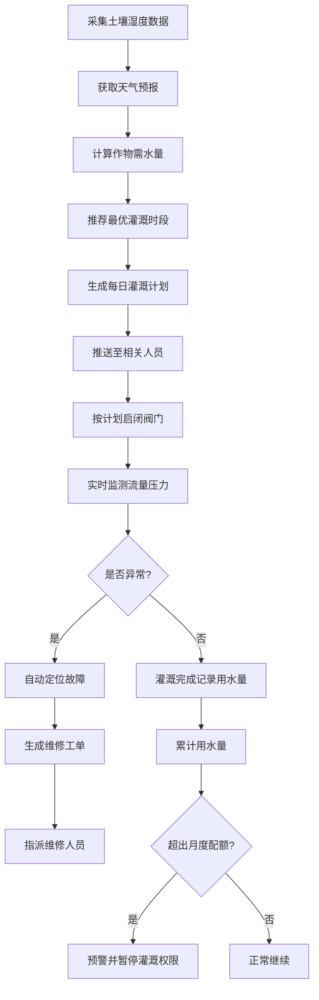
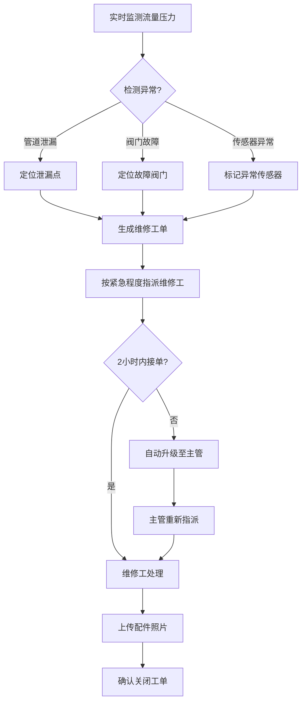
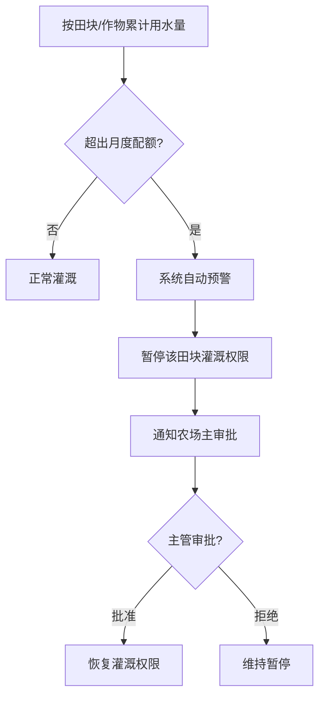

## 1. 产品概述

智慧农田节水灌溉与水资源调度平台，面向现代化农场管理场景，整合田块、传感器、阀门和水泵信息，实现灌溉全流程自动化与智能化。系统根据土壤湿度、作物需水量和天气预报自动生成每日灌溉计划，智能调度阀门启闭时间，实时监测异常并自动派发维修工单，按田块与作物累计用水量并在超出配额时预警，最终通过首页大屏实现全局实时监控与数据分析。

- 解决传统灌溉效率低、水资源浪费、故障响应慢等问题
- 目标用户：规模化农场（农场主、技术员、维修工、农户）

## 2. 核心功能

### 2.1 用户角色

| 角色 | 注册方式 | 核心权限 |
|------|----------|----------|
| 农户 | 管理员分配账号 | 仅查看自己田块的灌溉计划、土壤数据、用水量 |
| 技术员 | 管理员分配账号 | 管理传感器、配置灌溉策略、查看全局田块数据 |
| 维修工 | 管理员分配账号 | 查看和处理指派给自己的维修工单、上传配件照片 |
| 农场主 | 系统初始账号 | 全局管理、调整配额与排程规则、审批恢复灌溉权限、查看所有数据与报表 |

### 2.2 功能模块

1. **首页大屏**：土壤湿度热力图、当日灌溉进度、故障报修排行、水资源利用率、实时数据刷新（10秒）、筛选与导出
2. **田块管理**：田块信息CRUD、关联传感器/阀门/水泵、作物类型配置
3. **灌溉计划**：自动生成每日计划、智能调度阀门启闭、推荐最优灌溉时段、手动调整计划
4. **设备监控**：传感器实时数据（土壤湿度、流量、压力）、阀门状态、水泵运行时长与状态、异常自动定位
5. **工单管理**：故障自动生成工单、按紧急程度指派、超2小时未接单自动升级、维修完成后上传配件照片确认
6. **水资源管理**：按田块/作物累计用水量、月度配额预警、超额自动暂停灌溉权限、主管审批恢复、月度报表导出
7. **系统设置**：用户权限管理、配额配置、排程规则调整、设备参数配置

### 2.3 页面详情

| 页面名称 | 模块名称 | 功能描述 |
|----------|----------|----------|
| 首页大屏 | 土壤湿度热力图 | 各田块土壤湿度颜色热力展示，hover显示详情，数据每10秒刷新 |
| 首页大屏 | 当日灌溉进度 | 各田块灌溉进度条，已完成/进行中/待执行状态展示 |
| 首页大屏 | 故障报修排行 | 按设备类型统计故障次数TOP排名，点击跳转工单 |
| 首页大屏 | 水资源利用率 | 整体及各田块用水效率指标、配额使用进度 |
| 首页大屏 | 筛选与导出 | 按田块、作物类型、日期筛选，一键导出月度灌溉分析报告与用水成本明细 |
| 田块管理 | 田块列表 | 田块名称、面积、作物类型、关联设备数、土壤湿度、灌溉状态 |
| 田块管理 | 田块详情 | 关联传感器数据、阀门状态、水泵信息、历史灌溉记录 |
| 田块管理 | 新增/编辑田块 | 表单录入田块信息，关联设备选择 |
| 灌溉计划 | 今日计划 | 按时间轴展示各田块灌溉时段、阀门启闭时间、预计用水量 |
| 灌溉计划 | 智能推荐 | 系统推荐最优灌溉时段（避开高温、利用夜间低蒸发），显示推荐理由 |
| 灌溉计划 | 计划调整 | 手动修改灌溉时间、用水量，需备注原因 |
| 设备监控 | 传感器面板 | 实时土壤湿度/温度/流量/压力数据，趋势图表 |
| 设备监控 | 阀门控制面板 | 阀门开关状态、当前流量、远程启闭操作 |
| 设备监控 | 水泵监控面板 | 运行时长、累计运行时长、当前状态、故障报警 |
| 设备监控 | 异常告警 | 管道泄漏/阀门故障/传感器异常实时告警列表，自动定位 |
| 工单管理 | 工单列表 | 按状态（待接单/进行中/已完成）筛选，显示紧急程度、设备信息 |
| 工单管理 | 工单详情 | 故障描述、定位信息、指派维修工、处理进度、配件照片上传 |
| 工单管理 | 超时升级 | 超2小时未接单自动升级至主管，标红提示 |
| 水资源管理 | 用水量统计 | 按田块/作物/时间段累计用水量图表 |
| 水资源管理 | 配额管理 | 月度配额设置、使用进度、超额预警标记 |
| 水资源管理 | 灌溉权限 | 超额田块自动暂停灌溉权限，主管审批恢复操作 |
| 水资源管理 | 报表导出 | 月度灌溉分析报告PDF、用水成本明细Excel |
| 系统设置 | 用户管理 | 四级角色账号增删改查、权限分配 |
| 系统设置 | 配额配置 | 按田块/作物设置月度用水配额 |
| 系统设置 | 排程规则 | 灌溉时段规则、最优时段权重、自动调度参数 |

## 3. 核心流程

### 3.1 灌溉计划自动生成流程

系统每日凌晨自动执行：采集各田块土壤湿度传感器数据 → 获取天气预报（温度、降雨概率）→ 根据作物需水量模型计算各田块需灌水量 → 结合排程规则推荐最优灌溉时段 → 生成当日灌溉计划（含阀门启闭时间表）→ 推送至相关人员 → 按计划自动执行阀门启闭。

### 3.2 故障处理流程

灌溉过程监测异常 → 自动定位故障设备 → 生成维修工单（含紧急程度）→ 指派维修人员 → 超2小时未接单自动升级至主管 → 维修工处理完成 → 上传更换配件照片确认 → 关闭工单。

### 3.3 用水配额管控流程

## 4. 用户界面设计

### 4.1 设计风格

- **主色调**：深青绿（#0D7377）象征水资源与生态，搭配深蓝灰（#1B2A4A）背景，强调专业与科技感
- **辅助色**：活力橙（#F59E0B）用于告警与紧急标识，翠绿（#10B981）用于正常/完成状态，珊瑚红（#EF4444）用于故障/超限
- **按钮风格**：圆角8px，主按钮实色填充，次按钮描边，hover微上浮+阴影
- **字体**：标题使用 Noto Sans SC Bold，正文使用 Noto Sans SC Regular，数字/数据使用 JetBrains Mono 等宽字体
- **布局风格**：左侧导航栏 + 顶部面包屑 + 主内容区卡片式布局，首页大屏全屏沉浸式
- **图标风格**：线性图标（Lucide），统一2px线宽，与文字等高对齐
- **整体调性**：深色科技感大屏 + 浅色管理界面，数据可视化优先，工业仪表盘风格

### 4.2 页面设计概览

| 页面名称 | 模块名称 | UI元素 |
|----------|----------|--------|
| 首页大屏 | 土壤湿度热力图 | 深色背景热力图，绿-黄-红渐变色阶，田块区块hover高亮弹出详情卡片 |
| 首页大屏 | 当日灌溉进度 | 横向进度条组，已完成绿色/进行中蓝色脉冲动画/待执行灰色 |
| 首页大屏 | 故障报修排行 | 横向柱状图，TOP5设备类型，红色渐变填充 |
| 首页大屏 | 水资源利用率 | 环形图+数字指标，配额使用进度条 |
| 首页大屏 | 筛选与导出 | 顶部筛选条（下拉+日期选择器），导出按钮带图标 |
| 田块管理 | 田块列表 | 卡片网格布局，每卡片含田块缩略图、关键数据指标、状态徽标 |
| 灌溉计划 | 今日计划 | 纵向时间轴，每段灌溉标注时段与田块，当前时间指针滑动 |
| 灌溉计划 | 智能推荐 | 推荐卡片组，带推荐理由标签，一键采纳按钮 |
| 设备监控 | 传感器面板 | 仪表盘式数值显示+折线趋势图，实时更新动画 |
| 设备监控 | 异常告警 | 右侧浮层告警列表，新告警滑入动画+声音提示 |
| 工单管理 | 工单列表 | 看板式布局（待接单/进行中/已完成三列），拖拽状态变更 |
| 水资源管理 | 用水量统计 | 多维度图表（田块对比柱状图、月度趋势折线图） |
| 水资源管理 | 配额管理 | 进度条+百分比，超额标红闪烁 |

### 4.3 响应式设计

- 桌面优先设计，最低支持1280px宽度
- 大屏页面（首页）固定1920x1080最佳展示
- 管理页面在1024-1920px区间自适应
- 移动端暂不支持（农场场景以PC/大屏为主）

### 4.4 数据刷新策略

- 首页大屏数据每10秒自动刷新，使用轮询机制
- 设备监控页面实时数据每5秒刷新
- 其他页面操作时刷新，不自动轮询
- 刷新时使用骨架屏过渡，避免闪烁
