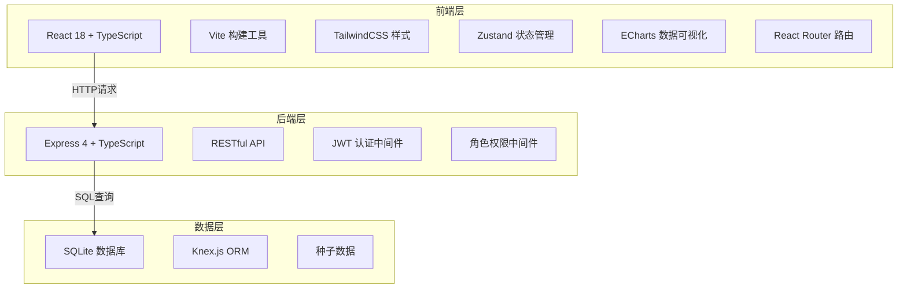
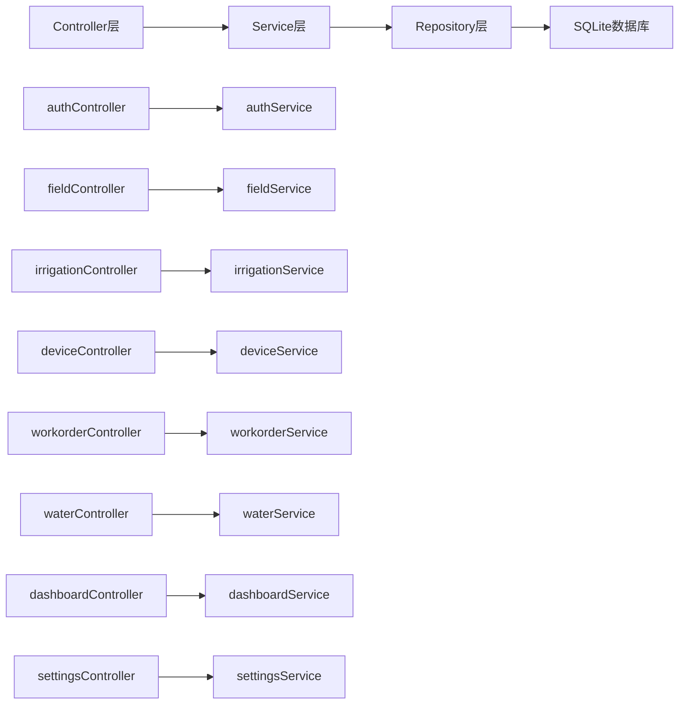
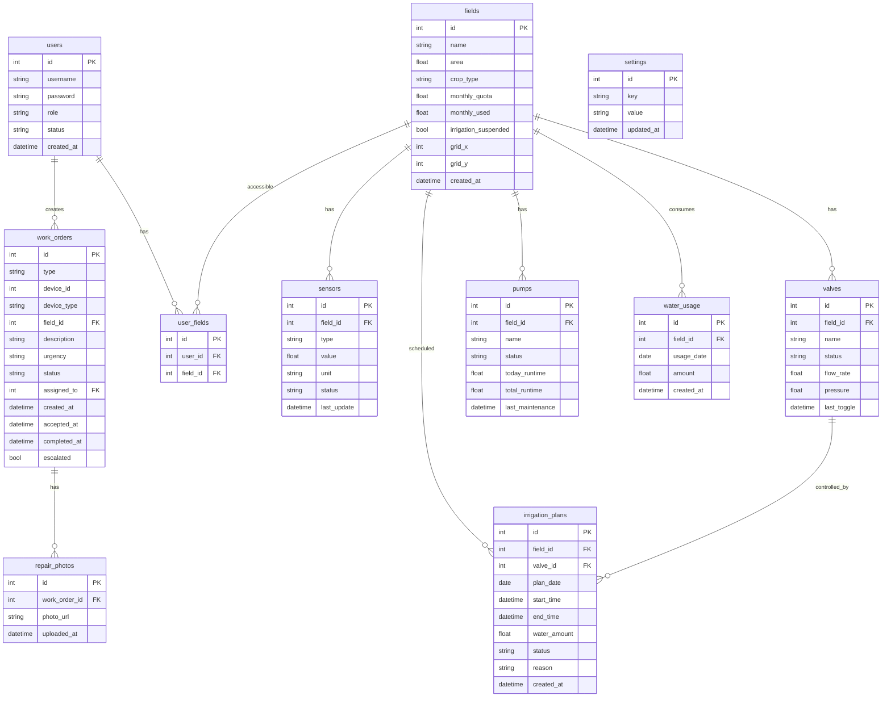

## 1. 架构设计



## 2. 技术说明

- **前端**: React@18 + TailwindCSS@3 + Vite + TypeScript
- **初始化工具**: vite-init (react-express-ts 模板)
- **后端**: Express@4 + TypeScript (ESM格式)
- **数据库**: SQLite + Knex.js
- **状态管理**: Zustand
- **数据可视化**: ECharts (热力图、折线图、柱状图、环形图)
- **路由**: React Router DOM
- **图标**: Lucide React
- **认证**: JWT Token
- **模拟数据**: 种子数据初始化

## 3. 路由定义

| 路由 | 用途 | 权限 |
|------|------|------|
| `/` | 首页大屏仪表盘 | 所有角色 |
| `/fields` | 田块管理列表 | 技术员、农场主 |
| `/fields/:id` | 田块详情 | 技术员、农场主、农户(仅自己的田块) |
| `/irrigation` | 灌溉计划 | 技术员、农场主、农户(仅自己的田块) |
| `/devices` | 设备监控 | 技术员、农场主 |
| `/workorders` | 工单管理 | 维修工、技术员、农场主 |
| `/water` | 水资源管理 | 技术员、农场主 |
| `/settings` | 系统设置 | 农场主 |
| `/login` | 登录页 | 未登录 |

## 4. API定义

### 4.1 认证相关

```typescript
POST /api/auth/login
  Request: { username: string; password: string }
  Response: { token: string; user: { id: number; username: string; role: "farmer" | "technician" | "repairman" | "owner" } }

GET /api/auth/me
  Response: { id: number; username: string; role: string; fieldIds?: number[] }
```

### 4.2 田块管理

```typescript
GET /api/fields
  Response: Array<{ id: number; name: string; area: number; cropType: string; soilMoisture: number; irrigationStatus: string; deviceCount: number }>

GET /api/fields/:id
  Response: { id: number; name: string; area: number; cropType: string; soilMoisture: number; monthlyQuota: number; monthlyUsed: number; sensors: Sensor[]; valves: Valve[]; pumps: Pump[] }

POST /api/fields
  Request: { name: string; area: number; cropType: string; monthlyQuota: number }

PUT /api/fields/:id
  Request: { name?: string; area?: number; cropType?: string; monthlyQuota?: number }

DELETE /api/fields/:id
  Response: { success: boolean }
```

### 4.3 设备管理

```typescript
GET /api/sensors
  Response: Array<{ id: number; fieldId: number; type: string; value: number; unit: string; status: string; lastUpdate: string }>

GET /api/valves
  Response: Array<{ id: number; fieldId: number; status: "open" | "closed"; flowRate: number; lastToggle: string }>

GET /api/pumps
  Response: Array<{ id: number; name: string; status: "running" | "stopped" | "fault"; todayRuntime: number; totalRuntime: number; lastMaintenance: string }>

POST /api/valves/:id/toggle
  Request: { action: "open" | "closed" }
  Response: { success: boolean }
```

### 4.4 灌溉计划

```typescript
GET /api/irrigation/plans
  Query: { date?: string; fieldId?: number }
  Response: Array<{ id: number; fieldId: number; fieldName: string; startTime: string; endTime: string; waterAmount: number; status: "pending" | "running" | "completed" | "cancelled"; valveId: number }>

POST /api/irrigation/plans/generate
  Request: { date: string }
  Response: Array<IrrigationPlan>

PUT /api/irrigation/plans/:id
  Request: { startTime?: string; endTime?: string; waterAmount?: string; reason?: string }

GET /api/irrigation/recommendations
  Query: { date: string }
  Response: Array<{ fieldId: number; fieldName: string; recommendedTime: string; reason: string; expectedSaving: number }>
```

### 4.5 工单管理

```typescript
GET /api/workorders
  Query: { status?: string; assignedTo?: number }
  Response: Array<{ id: number; type: string; deviceId: number; deviceName: string; fieldId: number; description: string; urgency: "low" | "medium" | "high"; status: "pending" | "accepted" | "in_progress" | "completed"; assignedTo: number; assigneeName: string; createdAt: string; acceptedAt?: string; escalated: boolean; photos: string[] }>

POST /api/workorders
  Request: { type: string; deviceId: number; description: string; urgency: string }

PUT /api/workorders/:id/accept
  Response: { success: boolean }

PUT /api/workorders/:id/complete
  Request: { photos: string[] }
  Response: { success: boolean }

PUT /api/workorders/:id/escalate
  Response: { success: boolean }
```

### 4.6 水资源管理

```typescript
GET /api/water/usage
  Query: { fieldId?: number; cropType?: string; month?: string }
  Response: Array<{ fieldId: number; fieldName: string; cropType: string; monthlyQuota: number; monthlyUsed: number; dailyUsage: Array<{ date: string; amount: number }> }>

PUT /api/water/quota/:fieldId
  Request: { monthlyQuota: number }
  Response: { success: boolean }

POST /api/water/approve/:fieldId
  Request: { reason: string }
  Response: { success: boolean }

GET /api/water/export
  Query: { month: string; format: "pdf" | "excel" }
  Response: Binary file download
```

### 4.7 仪表盘数据

```typescript
GET /api/dashboard/heatmap
  Response: Array<{ fieldId: number; fieldName: string; x: number; y: number; moisture: number }>

GET /api/dashboard/progress
  Response: Array<{ fieldId: number; fieldName: string; progress: number; status: string }>

GET /api/dashboard/fault-ranking
  Response: Array<{ deviceType: string; count: number }>

GET /api/dashboard/water-efficiency
  Response: { overallRate: number; fieldRates: Array<{ fieldId: number; fieldName: string; rate: number }> }

GET /api/dashboard/realtime
  Response: { heatmap: HeatmapData[]; progress: ProgressData[]; faults: FaultData[]; efficiency: EfficiencyData }
```

### 4.8 系统设置

```typescript
GET /api/settings/users
  Response: Array<{ id: number; username: string; role: string; fieldIds: number[]; status: string }>

POST /api/settings/users
  Request: { username: string; password: string; role: string; fieldIds?: number[] }

PUT /api/settings/users/:id
  Request: { role?: string; fieldIds?: number[]; status?: string }

GET /api/settings/rules
  Response: { irrigationWindow: { start: string; end: string }; optimalTimeWeights: Record<string, number>; autoEscalationHours: number }

PUT /api/settings/rules
  Request: { irrigationWindow?: object; optimalTimeWeights?: object; autoEscalationHours?: number }
```

## 5. 服务器架构图



## 6. 数据模型

### 6.1 数据模型定义



### 6.2 数据定义语言

```sql
CREATE TABLE users (
    id INTEGER PRIMARY KEY AUTOINCREMENT,
    username TEXT NOT NULL UNIQUE,
    password TEXT NOT NULL,
    role TEXT NOT NULL CHECK(role IN ('farmer', 'technician', 'repairman', 'owner')),
    status TEXT NOT NULL DEFAULT 'active',
    created_at DATETIME DEFAULT CURRENT_TIMESTAMP
);

CREATE TABLE fields (
    id INTEGER PRIMARY KEY AUTOINCREMENT,
    name TEXT NOT NULL,
    area REAL NOT NULL,
    crop_type TEXT NOT NULL,
    monthly_quota REAL NOT NULL DEFAULT 0,
    monthly_used REAL NOT NULL DEFAULT 0,
    irrigation_suspended INTEGER NOT NULL DEFAULT 0,
    grid_x INTEGER NOT NULL DEFAULT 0,
    grid_y INTEGER NOT NULL DEFAULT 0,
    created_at DATETIME DEFAULT CURRENT_TIMESTAMP
);

CREATE TABLE user_fields (
    id INTEGER PRIMARY KEY AUTOINCREMENT,
    user_id INTEGER NOT NULL REFERENCES users(id),
    field_id INTEGER NOT NULL REFERENCES fields(id),
    UNIQUE(user_id, field_id)
);

CREATE TABLE sensors (
    id INTEGER PRIMARY KEY AUTOINCREMENT,
    field_id INTEGER NOT NULL REFERENCES fields(id),
    type TEXT NOT NULL,
    value REAL NOT NULL DEFAULT 0,
    unit TEXT NOT NULL,
    status TEXT NOT NULL DEFAULT 'normal',
    last_update DATETIME DEFAULT CURRENT_TIMESTAMP
);

CREATE TABLE valves (
    id INTEGER PRIMARY KEY AUTOINCREMENT,
    field_id INTEGER NOT NULL REFERENCES fields(id),
    name TEXT NOT NULL,
    status TEXT NOT NULL DEFAULT 'closed',
    flow_rate REAL NOT NULL DEFAULT 0,
    pressure REAL NOT NULL DEFAULT 0,
    last_toggle DATETIME
);

CREATE TABLE pumps (
    id INTEGER PRIMARY KEY AUTOINCREMENT,
    field_id INTEGER NOT NULL REFERENCES fields(id),
    name TEXT NOT NULL,
    status TEXT NOT NULL DEFAULT 'stopped',
    today_runtime REAL NOT NULL DEFAULT 0,
    total_runtime REAL NOT NULL DEFAULT 0,
    last_maintenance DATETIME
);

CREATE TABLE irrigation_plans (
    id INTEGER PRIMARY KEY AUTOINCREMENT,
    field_id INTEGER NOT NULL REFERENCES fields(id),
    valve_id INTEGER NOT NULL REFERENCES valves(id),
    plan_date DATE NOT NULL,
    start_time DATETIME NOT NULL,
    end_time DATETIME NOT NULL,
    water_amount REAL NOT NULL,
    status TEXT NOT NULL DEFAULT 'pending',
    reason TEXT,
    created_at DATETIME DEFAULT CURRENT_TIMESTAMP
);

CREATE TABLE water_usage (
    id INTEGER PRIMARY KEY AUTOINCREMENT,
    field_id INTEGER NOT NULL REFERENCES fields(id),
    usage_date DATE NOT NULL,
    amount REAL NOT NULL,
    created_at DATETIME DEFAULT CURRENT_TIMESTAMP
);

CREATE TABLE work_orders (
    id INTEGER PRIMARY KEY AUTOINCREMENT,
    type TEXT NOT NULL,
    device_id INTEGER NOT NULL,
    device_type TEXT NOT NULL,
    field_id INTEGER REFERENCES fields(id),
    description TEXT NOT NULL,
    urgency TEXT NOT NULL CHECK(urgency IN ('low', 'medium', 'high')),
    status TEXT NOT NULL DEFAULT 'pending',
    assigned_to INTEGER REFERENCES users(id),
    created_at DATETIME DEFAULT CURRENT_TIMESTAMP,
    accepted_at DATETIME,
    completed_at DATETIME,
    escalated INTEGER NOT NULL DEFAULT 0
);

CREATE TABLE repair_photos (
    id INTEGER PRIMARY KEY AUTOINCREMENT,
    work_order_id INTEGER NOT NULL REFERENCES work_orders(id),
    photo_url TEXT NOT NULL,
    uploaded_at DATETIME DEFAULT CURRENT_TIMESTAMP
);

CREATE TABLE settings (
    id INTEGER PRIMARY KEY AUTOINCREMENT,
    key TEXT NOT NULL UNIQUE,
    value TEXT NOT NULL,
    updated_at DATETIME DEFAULT CURRENT_TIMESTAMP
);
```
